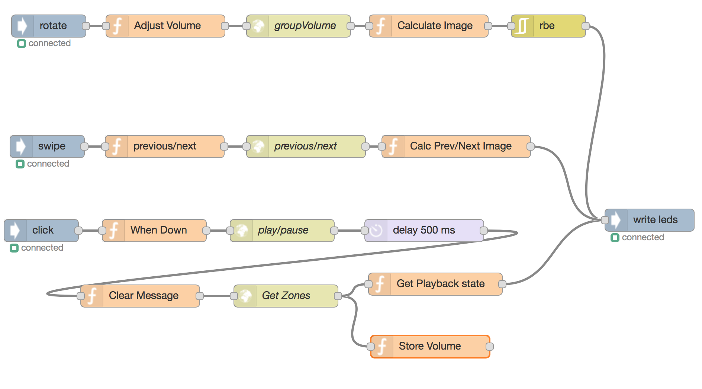

# node-red-contrib-nuimo
interact with Nuimo bluetooth devices

Adds input nodes to handle the following:
- Swipe
- Button Click
- Rotation

Adds output node to handle:
- Writing to 9x9 LEDs

## Sample Flow
Here's my use case: I have node-red running on a raspberry pi at home. I setup a flow, connecting various events from the Nuimo to my sonos sound system using [node-sonos-http-api](https://github.com/jishi/node-sonos-http-api).

## Thanks
This project piggy backs largely off of [noble](https://github.com/sandeepmistry/noble).
